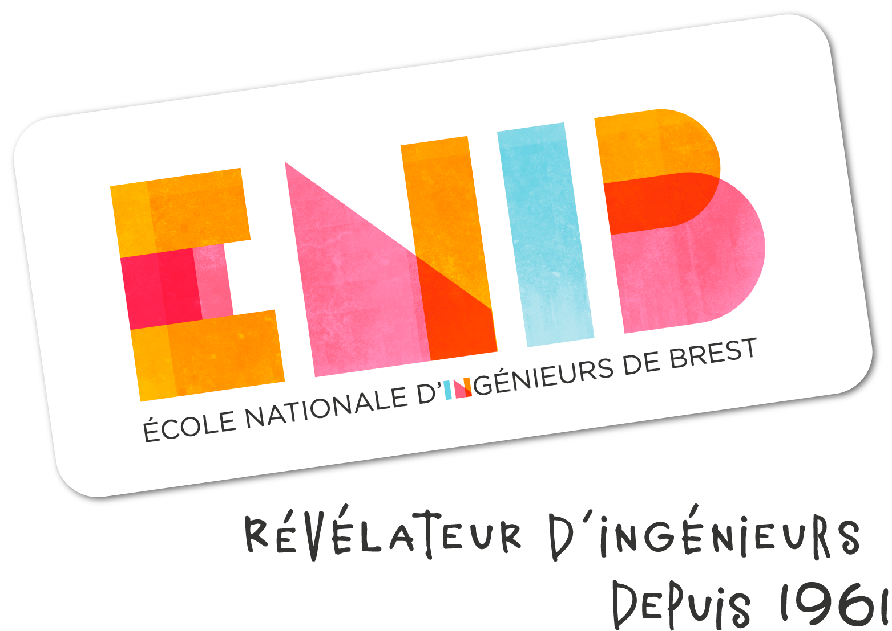

<style>
@import 'base';
</style>

<!-- _footer: p9walcza@enib.fr -->



# Internship Semester 8
### **Assistant engineering internship**

ENIB : https://www.enib.fr/
Upteko ApS: https://www.upteko.com/


---

# **Exemple of code blocks**

```python
class Path():
	def __init__(self, a1, a2):
		self.line = Line(Point(a1.x, a1.y), Point(a2.x, a2.y))

	def draw(self):
		self.line.setFill(blue)
		self.line.draw(win)
```

# And inline
`Inline block`

---

# **Exemple of list and table**
# Numbered list
1. First point
2. Second
   1. Inside
      1. Again inside
3. End of numbered list

---

# Unumbered list

* First point
* Second
  * Inside
    * Again inside
* End  of unnumbered list

---

# Table

|First row|Second row|
|:-------:|:--------:|
|  (0, 0) |  (0, 1)  |
|  (1, 0) |  (1, 1)  |
|  (2, 0) |  (2, 1)  |